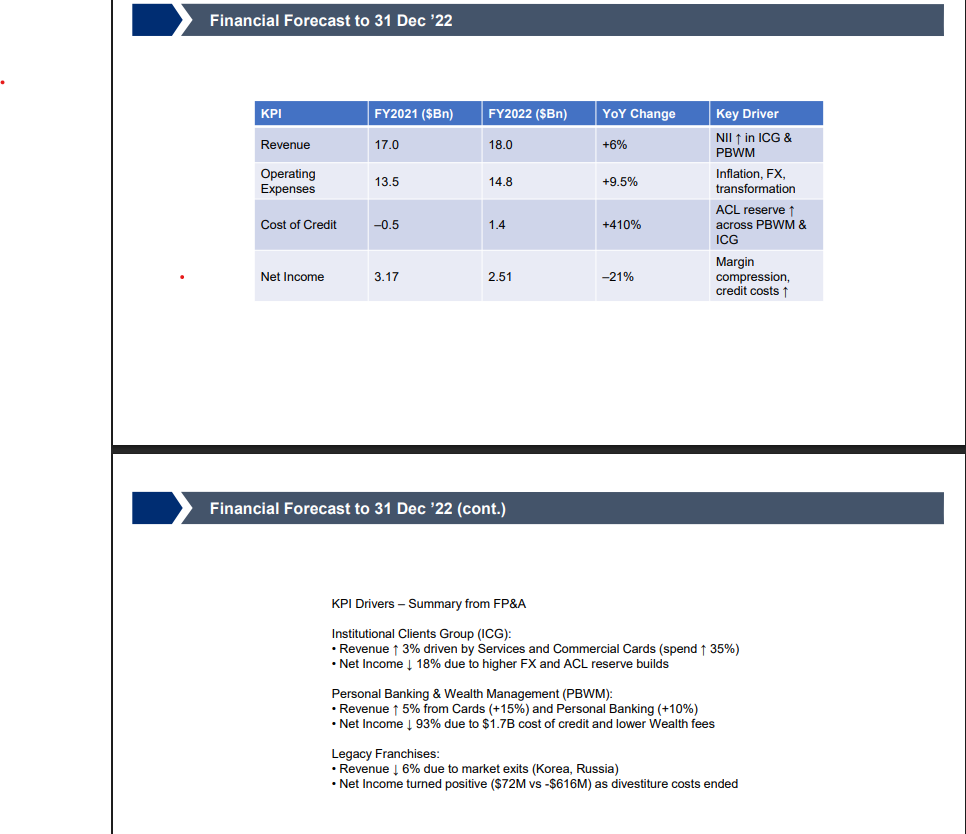

# Task 1 – Budget Slide Deck

A summary deck highlighting key revenue trends and top growth drivers for the 2022 AOP.  
Prepared as part of the Citi Finance Virtual Internship.

---

## ✅ Deliverables:
- 📊 Slide Deck (PDF): [Citi_FY2022_KPI_Summary_Rajathesh.pdf](./Citi_FY2022_KPI_Summary_Rajathesh.pdf)
- 📎 PowerPoint File: [Finance - Task 1 - Draft Slide Pack.pptx](./Finance%20-%20Task%201%20-%20Draft%20Slide%20Pack.pptx)
- 🖼️ Screenshot Preview:

---

📌 This submission was made as part of the Citi Virtual Finance Internship via Forage.

