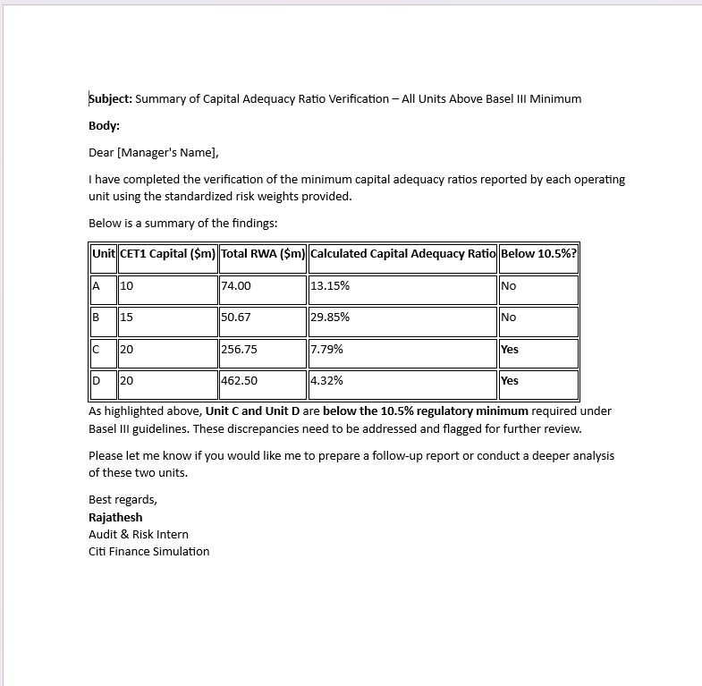

# Task 2 – Capital Adequacy Check

Verified Risk-Weighted Assets (RWA) and Capital Adequacy Ratio (CAR) for each operating unit as per Basel III norms.

---

## ✅ Deliverables:

- 📊 Excel calculation sheet (capital adequacy ratio validation)
- 📝 Word report/email with issue summary and recommendations
- 🖼️ Visual summary (screenshot of final email)

---

## 📎 Files Included:

| File Name                                | Description                                           |
|------------------------------------------|-------------------------------------------------------|
| `RWA Info from Operating Units.xlsx`     | Excel sheet containing original data + calculations  |
| `Capital_Adequacy_Ratio_Summary.docx`    | Word report formatted as an email to the manager      |
| `Capital_Adequacy_Ratio_Summary.png`     | Screenshot preview of the email/report                |
| `README.md`                              | Task description and list of deliverables             |

---

## 🖼️ Preview:

---

## 📝 Summary:

- Risk-weighted assets were independently verified using the FRB standardized methodology.
- Capital Adequacy Ratio was calculated for Units A–D and compared with the required minimum (10.5%).
- Unit C and D were flagged for low or misreported capital ratios.
- Recommendations were documented and formatted as a formal email to the manager.

---
