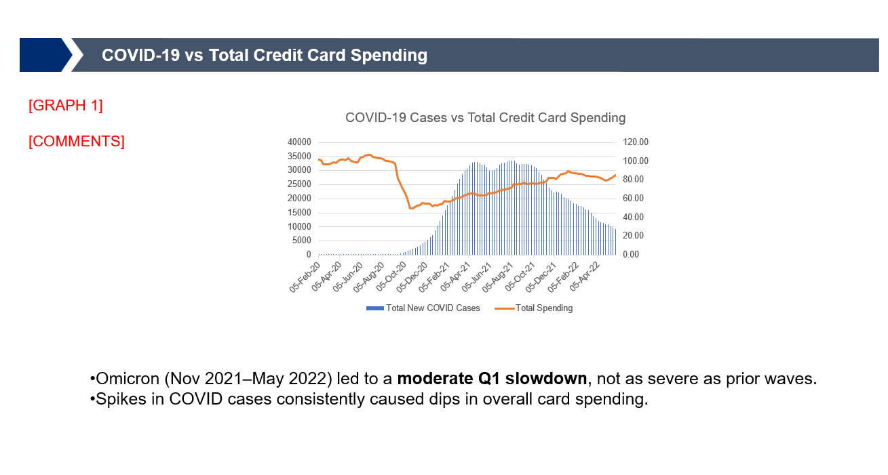
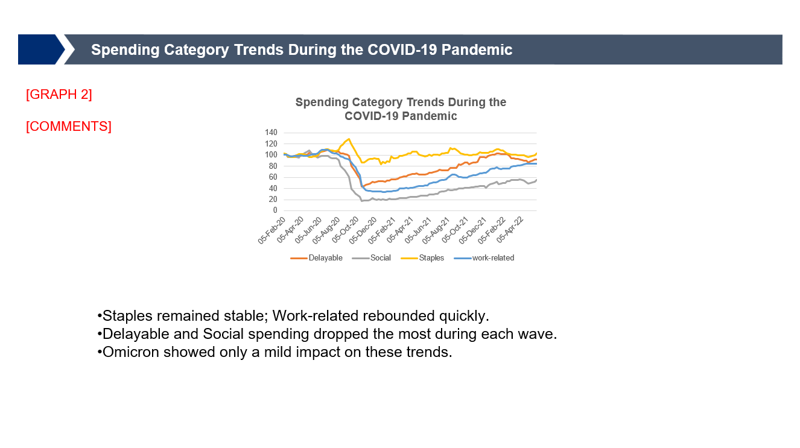
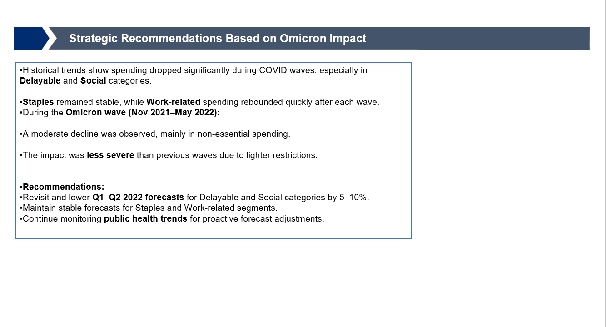

# 📊 Task 3 – Omicron Impact Analysis

This task is part of the Citi Finance Virtual Internship and focuses on evaluating the financial impact of the Omicron COVID-19 wave.

## 📁 Files Included
- `CITI TASK3 S1.png` – Slide 1: Introduction and objective
- 
- `CITI TASK3 S2.png` – Slide 2: Key metrics and financial trends
- 
- `CITI TASK3 S3.png` – Slide 3: Impact summary and analysis
- 
- `Risk_Triggers_Surplus_Tracking_Report_Jan-Feb2023.pdf` – Final consolidated report submission
[📄 Risk_Triggers_Surplus_Tracking_Report_Jan-Feb2023.pdf](./Risk_Triggers_Surplus_Tracking_Report_Jan-Feb2023.pdf)

## 🔍 Objective
Analyze how the Omicron variant influenced deposit flows, surplus fluctuations, and early warning triggers across key entities using January–February 2023 data.

## 🛠️ Tools & Skills Used
- Data visualization (PowerPoint)
- Financial trend monitoring
- Risk indicator analysis (EWT & MAT triggers)
- Reporting insights and action recommendations

## ✅ Outcome
Prepared a structured risk tracking report with visualizations and commentary. Assessed entity-level financial health and suggested appropriate actions for CFO escalation.

---
📌 *Part of the Citi Finance Virtual Internship – Rajathesh H M*
