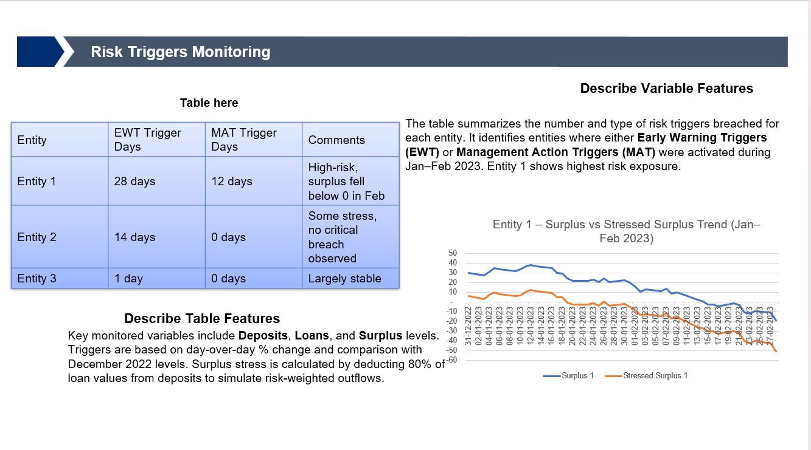
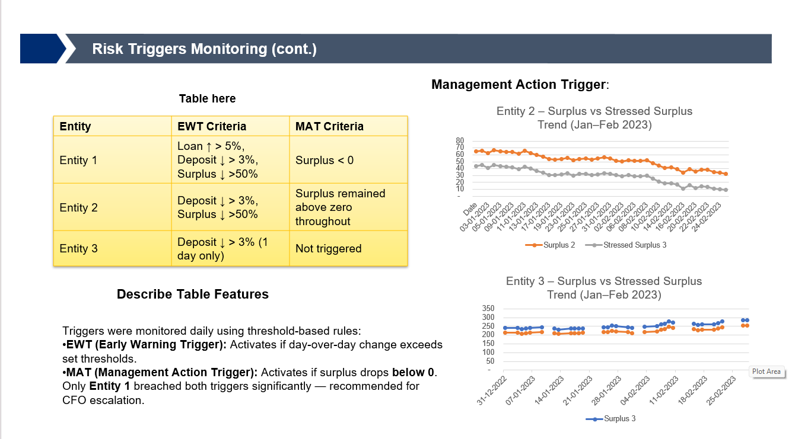

# 📊 Task 4 – Monthly Limits & Deposits Tracking Report

This task involved analyzing monthly deposit activity across entities to track Early Warning Triggers (EWT) and MAT (Minimum Account Threshold) breaches. Based on trends, appropriate escalation and oversight decisions were proposed.

---

## 📄 Report Document

🔗 [Risk_Triggers_Surplus_Tracking_Report_Jan-Feb2023.pdf](Risk_Triggers_Surplus_Tracking_Report_Jan-Feb2023.pdf)  
A PDF summary of all risk triggers, deposit trends, and escalation recommendations for January–February 2023.

---

## 🖼️ Slides

### Slide 1 – Overview of Trigger Framework and Setup  

---

### Slide 2 – Entity-Level Summary and Action Points  

---

## 🧠 Insights Extracted

- **Entity 1**: Breached both EWT and MAT thresholds. High risk. CFO escalation recommended.
- **Entity 2**: Triggered Early Warning. Moderate stress. Should be closely monitored.
- **Entity 3**: Remained stable. No action required.

---

## ✅ Outcome

This task resulted in a concise internal report that:
- Highlighted critical entity-level risks
- Recommended escalation protocols
- Suggested automation for breach alerts
